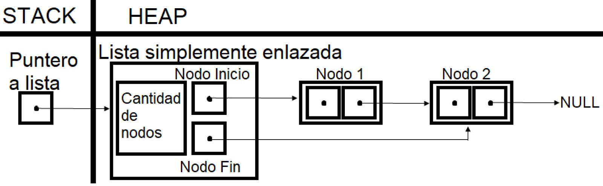

<div align="right">

</div>

# NOMBRE TP/TDA

## Repositorio de Matias Ferrero - 109886 - mferreroc@fi.uba.ar

- Para compilar y correr pruebas locales con makefile:

```
make
```

- Para compilar y correr ejemplo con makefile:

```
make valgrind-ejemplo
```

- Para compilar y correr pruebas de la catedra con makefile:
```
make valgrind-chanutron
```
---
##  Funcionamiento

Este programa implementa tres TDA ‘s, una pila, una cola, y una lista, esta última con un iterador interno y 
otro externo, mediante el uso de nodos, otro TDA. A su vez, la implementación de la lista simplemente enlazada 
con nodos se reutiliza para implementar la pila y la cola.
El programa recibe los datos necesarios que entrega el usuario (elementos, posiciones, funciones, etc.), y 
realiza las operaciones válidas de cada TDA.
La implementación hecha de la lista simplemente enlazada con los nodos, y por ende de los demás TDA ‘s es la siguiente:

<div align="center">

</div>

Además, en caso de que a los elementos guardados se les asigne memoria dinamica, la tiene implementada un 
destructor para liberar esa memoria en caso de quitar elementos,o destruir la lista, por lo que la 
implementación de la lista también se hace cargo de no perder esa memoria, una vez se guarda en el TDA.

Por otro lado, también se implementan el iterador interno y el iterador externo.
El iterador interno recorre todos los nodos accediendo a la lista, aplicando a cada uno la función que reciba 
por parámetros.
En cambio, el iterador externo es otro TDA que tiene en su estructura un puntero a la lista del cual se 
implementó, y un puntero al nodo al cual acceda. Itera los nodos uno a uno y le permite al usuario obtener el 
elemento que inserta en la lista. Cabe destacar que el iterador se implementa en base a una lista en 
particular, en caso de modificar la lista de cualquier manera, el iterador también se destruirá.

---
## Respuestas a las preguntas teóricas

- ¿Qué es una lista/pila/cola? Explicar con diagramas.

Tanto una lista, como una pila, como una cola, son tres tipos distintos de TDA (tipos de datos abstractos).
Estos tres TDA’s guardan elementos mediante algunas operaciones que funcionan diferente según qué TDA sea, pero 
que los tres tienen en común:
-Crear TDA
-Guardar elemento
-Leer elemento
-Quitar elemento
-Verificar si está vacía
-Destruir TDA

Puntualmente, la pila y la cola tienen características particulares; la pila tiene una política LIFO y la cola 
tiene una política FIFO.
LIFO quiere decir “Last In First Out”, o en español, el último en entrar es el primero en salir. Eso quiere 
decir que en las pilas, el último elemento guardado es el primero en ser quitado, de forma que solo conocemos 
el tope de las pilas, y por ende, solo podemos leer el tope por muchos elementos que haya.

<div align="center">

</div>

<div align="center">

</div>

<div align="center">

</div>

Por otro lado FIFO quiere decir “First In First Out”, o en español, el primero en entrar es el primero en 
salir. Gracias a esto, las colas funcionan de forma diferente; el primer elemento guardado en las colas es el 
primero en ser quitado. Con las colas, se pueden guardar varios elementos pero sólo podremos leer y quitar su 
frente.

<div align="center">

</div>

<div align="center">

</div>

<div align="center">

</div>

Las listas no tienen política LIFO o FIFO, por lo que se puede guardar, quitar o leer elementos en cualquier 
posición.

- Explica y analiza las diferencias de complejidad entre las implementaciones de lista simplemente enlazada, 
doblemente enlazada y vector dinámico para las operaciones:

Para implementar las listas, se utiliza una lista simplemente enlazada con nodos, pero para explicar cómo 
funcionan es necesario entender qué es un nodo.
Un nodo es otro TDA, que guarda los elementos que se quieren almacenar en otros TDA 's como las listas, las 
pilas o las colas. Estos nodos tienen dos punteros, uno para guardar el elemento, y otro para guardar el 
siguiente o anterior nodo que le corresponde.
Dicho esto, las listas simplemente enlazadas tienen un nodo inicial y un nodo final, con una cadena unilateral 
de nodos entre ambos. La diferencia con listas doblemente enlazadas, es que las cadenas están bilateralmente 
conectadas, pero también tienen un nodo inicial y final.
A diferencia de las listas enlazadas, los vectores dinámicos no utilizan nodos, simplemente son vectores que 
cambian su memoria dinámicamente según lo necesite el usuario para insertar o quitar elementos.
Cabe destacar que para analizar la complejidad de las opreciones, se utiliza la notación Big(O).

   - Insertar/obtener/eliminar al inicio:
        Para ambas listas enlazadas con nodos, al tener una referencia al nodo inicial, insertar al 
        inicio tiene complejidad O(1) en ambos casos. Pero, para las listas implementadas como vectores 
        dinámicos, y debido a que se utiliza realloc, la complejidad es O(n).
        La referencia al nodo inicial también nos facilita buscar el primer elemento de ambas listas enlazadas, 
        por lo que queda O(1) en ambos casos. Y en el caso de vectores dinámicos, al tener la posición no 
        necesito recorrer el vector, entonces también es O(1).
        La referencia al nodo inicial también ayuda a quitar elementos al inicio en listas enlazadas, y otra 
        vez, en ambos casos la complejidad es O(1). Para el caso de vectores dinámicos, quitar elementos tiene 
        complejidad O(1), pero si decir usar realloc para eliminar un exceso de memoria que no se utiliza, la 
        complejidad pasa a ser O(n).

   - Insertar/obtener/eliminar al final:
        Mismo caso que el anterior, para ambas listas enlazadas con nodos, al tener una referencia al nodo 
        final, insertar al final tiene complejidad O(1) en ambos casos. Igual que en el caso anterior, debido a 
        que se utiliza realloc, la complejidad de insertar al final en los vectores dinámicos es O(n).
        Mismo caso que el anterior, para ambas listas enlazadas con nodos, al tener una referencia al nodo 
        final, buscar un elemento al final tiene complejidad O(1) en ambos casos. Igual que en el caso 
        anterior, debido a que se utiliza la posición, la complejidad de buscar al final en los vectores 
        dinámicos es O(1).
        Para listas simplemente enlazadas, es necesario recorrer los nodos para llegar al anterior a quitar 
        debido a que no se puede volver hacia atrás desde la referencia al nodo final, por lo que quitar al 
        final tiene una complejidad de O(n). Esto no sucede para listas doblemente enlazadas, ya que con la 
        referencia al nodo final se puede retroceder una posición, y estas operaciones son O(1). Mismo caso que 
        el anterior, quitar en vectores dinámicos es O(1), sea al final o no, pero si se utiliza realloc para 
        eliminar excesos de memoria, la operación pasa a ser O(n).

   - Insertar/obtener/eliminar al medio:
        Como no existe referencia de la posición de los elementos en una lista con nodos, no queda más opción 
        que recorrer todos los nodos de la lista, por lo que la complejidad en listas simplemente enlazadas es 
        O(n). Para listas doblemente enlazadas, puedo recorrer desde el inicio o el final, pero también tengo 
        que recorrer los nodos, por lo tanto, también es O(n). Por último, como en todos los casos de inserción 
        en vectores dinámicos por el realloc, la complejidad es O(n).
        Otra vez, al no contar con una referencia a la posición, necesitamos recorrer todos los nodos de las 
        listas enlazadas para buscar elementos al medio de la lista, y ese proceso implica una complejidad de O
        (n). Pero como si se tiene la posición en los vectores dinámicos, la complejidad de buscar en cualquier 
        posición es O(1).
        Por último, no tener referencia a las posiciones hace que quitar elementos al medio genere una 
        complejidad de O(n) al recorrer todos los nodos en listas enlazadas. Pero, como en los casos 
        anteriores, quitar elementos con la posición como referencia evita recorrer el vector completo, 
        entonces en vectores dinámicos, la complejidad de quitar al medio es O(1).

- Explica la complejidad de las operaciones implementadas en tu trabajo para la pila y la cola.

Para la implementación de la pila y la cola en este trabajo, se reutiliza la implementación hecha de lista 
simplemente enlazadas con nodos. Por lo tanto, la complejidad algorítmica de las implementaciones de la pila y 
la cola, es la misma complejidad que en la implementación de la lista. Además de las ya explicadas, la 
complejidad de crear los TDA ‘s es O(1), al igual que la complejidad de destruir (excepto el caso en el que 
haya que destruir los elementos, si se les reservó memoria).