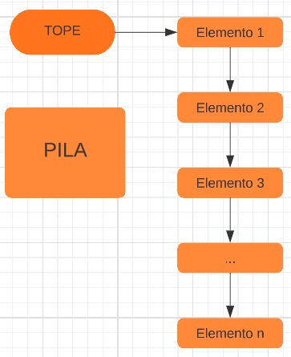
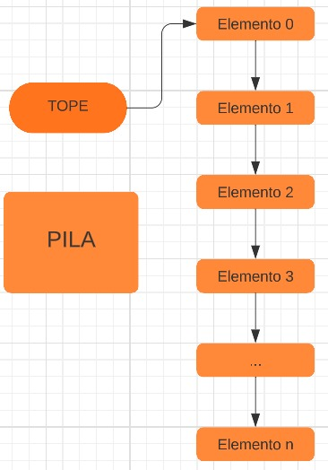
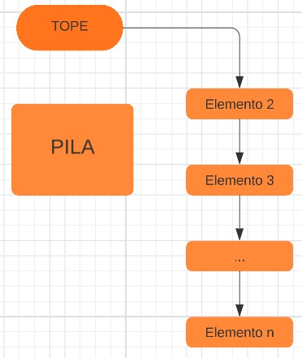
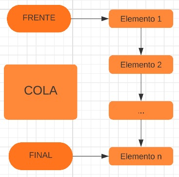
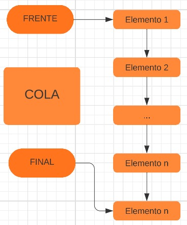
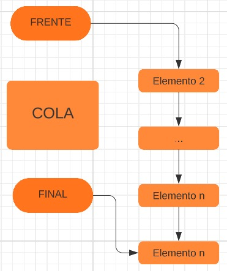

<div align="right">

</div>

# NOMBRE TP/TDA

## Repositorio de Matias Ferrero - 109886 - mferreroc@fi.uba.ar

- Para compilar:

```bash
línea de compilación
```

- Para ejecutar:

```bash
línea de ejecución
```

- Para ejecutar con valgrind:
```bash
línea con valgrind
```
---
##  Funcionamiento

Explicación de cómo funcionan las estructuras desarrolladas en el TP y el funcionamiento general del mismo.

Aclarar en esta parte todas las decisiones que se tomaron al realizar el TP, cosas que no se aclaren en el enunciado, fragmentos de código que necesiten explicación extra, etc.

Incluír **EN TODOS LOS TPS** los diagramas relevantes al problema (mayormente diagramas de memoria para explicar las estructuras, pero se pueden utilizar otros diagramas si es necesario).

### Por ejemplo:

El programa funciona abriendo el archivo pasado como parámetro y leyendolo línea por línea. Por cada línea crea un registro e intenta agregarlo al vector. La función de lectura intenta leer todo el archivo o hasta encontrar el primer error. Devuelve un vector con todos los registros creados.

<div align="center">

</div>

En el archivo `sarasa.c` la función `funcion1` utiliza `realloc` para agrandar la zona de memoria utilizada para conquistar el mundo. El resultado de `realloc` lo guardo en una variable auxiliar para no perder el puntero original en caso de error:

```c
int *vector = realloc(vector_original, (n+1)*sizeof(int));

if(vector == NULL)
    return -1;
vector_original = vector;
```


<div align="center">

</div>

---

## Respuestas a las preguntas teóricas

- ¿Qué es una lista/pila/cola? Explicar con diagramas.

Tanto una lista, como una pila, como una cola, son tres tipos distintos de TDA (tipos de datos abstractos).
Estos tres TDA’s guardan elementos mediante algunas operaciones que funcionan diferente según qué TDA sea, pero 
que los tres tienen en común:
-Crear TDA
-Guardar elemento
-Leer elemento
-Quitar elemento
-Verificar si está vacía
-Destruir TDA

Puntualmente, la pila y la cola tienen características particulares; la pila tiene una política LIFO y la cola 
tiene una política FIFO.
LIFO quiere decir “Last In First Out”, o en español, el último en entrar es el primero en salir. Eso quiere 
decir que en las pilas, el último elemento guardado es el primero en ser quitado, de forma que solo conocemos 
el tope de las pilas, y por ende, solo podemos leer el tope por muchos elementos que haya.

<div align="center">

</div>

<div align="center">

</div>

<div align="center">

</div>

Por otro lado FIFO quiere decir “First In First Out”, o en español, el primero en entrar es el primero en 
salir. Gracias a esto, las colas funcionan de forma diferente; el primer elemento guardado en las colas es el 
primero en ser quitado. Con las colas, se pueden guardar varios elementos pero sólo podremos leer y quitar su 
frente.

<div align="center">

</div>

<div align="center">

</div>

<div align="center">

</div>

Las listas no tienen política LIFO o FIFO, por lo que podemos guardar, quitar o leer elementos en cualquier 
posición.

- Explica y analiza las diferencias de complejidad entre las implementaciones de lista simplemente enlazada, doblemente enlazada y vector dinámico para las operaciones:

Para implementar las listas, utilice una lista simplemente enlazada con nodos, pero para explicar cómo 
funcionan es necesario entender qué es un nodo.
Un nodo es otro TDA, que guarda los elementos que se quieren almacenar en otros TDA 's como las listas, las 
pilas o las colas. Estos nodos tienen dos punteros, uno para guardar el elemento, y otro para guardar el 
siguiente o anterior nodo que le corresponde.
Dicho esto, las listas simplemente enlazadas tienen un nodo inicial y un nodo final, con una cadena unilateral 
de nodos entre ambos. La diferencia con listas doblemente enlazadas, es que las cadenas están bilateralmente 
conectadas, pero también tienen un nodo inicial y final.
A diferencia de las listas enlazadas, los vectores dinámicos no utilizan nodos, simplemente son vectores que 
cambian su memoria dinámicamente según lo necesite el usuario para insertar o quitar elementos.

   - Insertar/obtener/eliminar al inicio
   - Insertar/obtener/eliminar al final
   - Insertar/obtener/eliminar al medio
